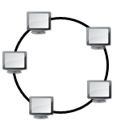
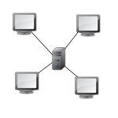
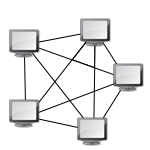

### Anneau

Chaque nœud (ordinateur ou équipement réseau) est connecté à deux autres, formant ainsi un cycle fermé. Les données circulent d’un nœud à l’autre dans le sens horaire ou antihoraire. L’avantage est que la transmission peut être fluide, mais la panne d’un seul nœud (ou de son lien) peut interrompre la communication de tout l’anneau.

### Bus

Tous les ordinateurs sont reliés à un même câble principal appelé « bus ». Chaque message circule le long de ce câble et peut être reçu par tous les appareils. Bien qu’économique et simple à mettre en place, cette topologie devient vite inefficace si le nombre de machines augmente ou si le câble unique tombe en panne.

### Etoile

Un dispositif central (commutateur, concentrateur, routeur) relie tous les nœuds entre eux. Les données passent donc par ce point central. Cette topologie est très répandue, car elle facilite la maintenance et l’identification des pannes, bien qu’elle dépende fortement de la fiabilité de l’équipement central. 

### Maillé

Chaque nœud est potentiellement connecté à tous les autres. Elle offre une grande redondance : si un lien tombe en panne, les données peuvent emprunter un autre chemin. En contrepartie, elle peut se révéler coûteuse à déployer et plus complexe à gérer, car elle nécessite un grand nombre de connexions.

