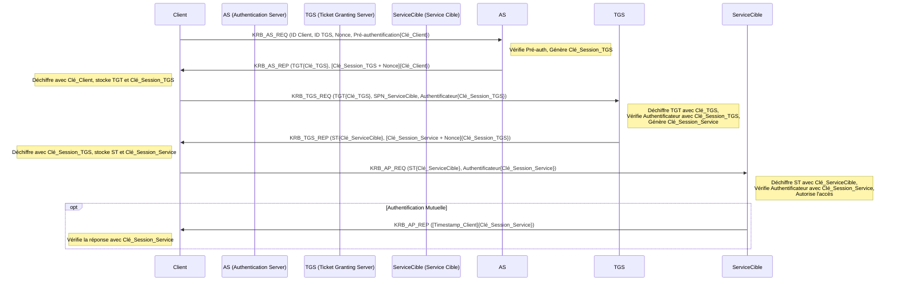

**1. Introduction**

Kerberos est un protocole d'authentification réseau basé sur un système de **tickets** et utilisant la **cryptographie symétrique**. Développé au MIT, son objectif principal est de permettre à des entités (utilisateurs, services) communiquant sur un réseau non sécurisé de prouver leur identité l'une à l'autre de manière sécurisée (authentification mutuelle). Il est conçu pour éviter la transmission de mots de passe en clair sur le réseau. Kerberos est le protocole d'authentification par défaut dans les domaines Microsoft Active Directory (AD).

Le principe repose sur une **tierce partie de confiance**, le Key Distribution Center (KDC), qui connaît les "secrets" (clés dérivées des mots de passe ou clés de service) de toutes les entités et délivre des tickets cryptés.

**2. Composants Clés**

* **Client :** L'utilisateur ou le service qui souhaite s'authentifier et accéder à une ressource.
* **Service Cible (Target Service) :** Le service (serveur de fichiers, serveur web, base de données...) auquel le client souhaite accéder. Chaque instance de service est identifiée de manière unique par un **Service Principal Name (SPN)**, par exemple `HTTP/websrv01.mondomaine.local` ou `CIFS/filesrv.mondomaine.local`.
* **Key Distribution Center (KDC) :** Le cœur du système, généralement hébergé sur un Contrôleur de Domaine (DC) dans AD. Il est composé de deux services logiques :
    * **Authentication Server (AS) :** Authentifie initialement le client et lui délivre un Ticket Granting Ticket (TGT).
    * **Ticket Granting Server (TGS) :** Délivre des tickets de service (Service Tickets) pour des services spécifiques, sur présentation d'un TGT valide.
* **Realm (Royaume) :** Le domaine administratif de Kerberos. Dans le contexte AD, un royaume Kerberos correspond généralement à un domaine AD.
* **Tickets :** Des données cryptées qui prouvent une identité ou une autorisation.
    * **Ticket Granting Ticket (TGT) :** Obtenu auprès de l'AS après une première authentification réussie. Il permet au client de prouver son identité au TGS sans avoir à redonner son mot de passe. Le TGT contient notamment une **Clé de Session TGS** (TGS Session Key) et des informations sur le client, le tout **chiffré avec la clé secrète du service TGS** (la clé du compte `krbtgt` dans AD).
    * **Ticket de Service (Service Ticket - ST) :** Obtenu auprès du TGS pour un service spécifique. Il permet au client de s'authentifier auprès de ce service. Le ST contient notamment une **Clé de Session de Service** (Service Session Key) et des informations sur le client, le tout **chiffré avec la clé secrète du Service Cible**.
* **Clés de Session (Session Keys) :** Des clés symétriques temporaires générées par le KDC pour sécuriser les échanges entre deux entités pour une session donnée (ex: Clé de Session TGS entre le client et le TGS, Clé de Session de Service entre le client et le Service Cible).
* **Authentificateur (Authenticator) :** Une structure de données créée par le client, contenant au minimum un timestamp et des informations sur le client, le tout **chiffré avec la Clé de Session appropriée** (TGS Session Key pour parler au TGS, Service Session Key pour parler au Service Cible). Il prouve que le client possède la clé de session et que la requête est récente (protection contre les attaques par rejeu).
* **Clés à Long Terme (Long-Term Keys) :**
    * *Clé Utilisateur :* Clé symétrique dérivée du mot de passe de l'utilisateur. Connue uniquement de l'utilisateur et du KDC.
    * *Clé de Service :* Clé symétrique associée à un compte de service. Connue uniquement du service et du KDC. Dans AD, elle est dérivée du mot de passe du compte de service associé au SPN. La clé du service TGS est celle du compte `krbtgt`.

**3. Le Flux d'Authentification Détaillé**

Le processus se déroule typiquement en trois échanges majeurs :

**Étape 1 : AS Exchange (Demande et Obtention du TGT)** - Messages `KRB_AS_REQ` et `KRB_AS_REP`

1.  **`KRB_AS_REQ` (Client -> AS) :**
    * Le client (ex: l'utilisateur qui ouvre sa session) envoie une requête à l'AS.
    * Contient : l'identifiant du client, l'identifiant du service TGS du royaume, un nonce (nombre aléatoire), et souvent des données de **pré-authentification**. La pré-authentification la plus courante consiste en un timestamp chiffré avec la **Clé Utilisateur** (dérivée du mot de passe). Cela prouve au KDC que le client connaît le mot de passe *avant* de délivrer un TGT.
2.  **Vérification par l'AS :**
    * L'AS recherche la Clé Utilisateur correspondante dans sa base (l'annuaire AD).
    * Il déchiffre les données de pré-authentification avec cette clé. Si le déchiffrement réussit et que le timestamp est valide (dans une fenêtre de temps acceptable pour contrer les rejeux), la pré-authentification est réussie.
3.  **Génération de la réponse par l'AS :**
    * L'AS génère une **Clé de Session TGS** aléatoire et unique pour cette session.
    * Il crée le **TGT**, qui contient : la Clé de Session TGS, l'identifiant du client, la durée de validité du TGT, le tout **chiffré avec la clé secrète du TGS** (clé du compte `krbtgt`). Le TGT est opaque pour le client.
4.  **`KRB_AS_REP` (AS -> Client) :**
    * L'AS renvoie au client un message contenant :
        * Le **TGT** (chiffré avec la clé du TGS).
        * La **Clé de Session TGS** et d'autres informations (durée de validité, nonce), le tout **chiffré avec la Clé Utilisateur**.
5.  **Traitement par le Client :**
    * Le client utilise sa propre Clé Utilisateur (dérivée de son mot de passe) pour déchiffrer la deuxième partie de la réponse.
    * Il récupère ainsi la **Clé de Session TGS** et stocke le **TGT** (qu'il ne peut pas lire) et la Clé de Session TGS dans son cache de tickets Kerberos (souvent géré par [Lsass.exe](Lsass.exe.md) sous Windows).
    * *À ce stade, le client est authentifié auprès du KDC et possède un TGT et la clé de session associée.*

**Étape 2 : TGS Exchange (Demande et Obtention du Ticket de Service)** - Messages `KRB_TGS_REQ` et `KRB_TGS_REP`

1.  **`KRB_TGS_REQ` (Client -> TGS) :**
    * Le client veut accéder à un service spécifique (ex: `CIFS/filesrv.mondomaine.local`).
    * Il envoie une requête au TGS.
    * Contient : Le **TGT** obtenu à l'étape 1, le **SPN** du service cible, un nonce, et un **Authentificateur**. L'Authentificateur contient un timestamp et l'identifiant du client, le tout **chiffré avec la Clé de Session TGS** récupérée à l'étape 1.
2.  **Vérification par le TGS :**
    * Le TGS reçoit la requête et utilise sa propre clé secrète (clé du compte `krbtgt`) pour déchiffrer le **TGT**.
    * Il extrait la **Clé de Session TGS** contenue dans le TGT.
    * Il utilise cette Clé de Session TGS pour déchiffrer l'**Authentificateur** envoyé par le client.
    * Il vérifie le timestamp de l'Authentificateur (contre le rejeu) et compare l'identifiant client de l'Authentificateur avec celui du TGT.
3.  **Génération de la réponse par le TGS :**
    * Si tout est valide, le TGS génère une **Clé de Session de Service** aléatoire et unique pour la communication entre le client et le service cible.
    * Il crée le **Ticket de Service (ST)**, qui contient : la Clé de Session de Service, l'identifiant du client, la durée de validité, le tout **chiffré avec la clé secrète du Service Cible** (associée au SPN demandé). Le ST est opaque pour le client.
4.  **`KRB_TGS_REP` (TGS -> Client) :**
    * Le TGS renvoie au client un message contenant :
        * Le **Ticket de Service (ST)** (chiffré avec la clé du service cible).
        * La **Clé de Session de Service** et d'autres informations (durée de validité, nonce), le tout **chiffré avec la Clé de Session TGS**.
5.  **Traitement par le Client :**
    * Le client utilise la **Clé de Session TGS** (qu'il avait stockée) pour déchiffrer la deuxième partie de la réponse.
    * Il récupère ainsi la **Clé de Session de Service** et stocke le **Ticket de Service (ST)** (opaque) et la Clé de Session de Service dans son cache.
    * *À ce stade, le client possède un ticket l'autorisant à parler au service cible et la clé de session pour sécuriser cet échange.*

**Étape 3 : AP Exchange (Authentification auprès du Service Cible)** - Messages `KRB_AP_REQ` et `KRB_AP_REP` (AP = Application)

1.  **`KRB_AP_REQ` (Client -> Service Cible) :**
    * Le client contacte enfin le service cible.
    * Il envoie une requête contenant :
        * Le **Ticket de Service (ST)** obtenu à l'étape 2.
        * Un **nouvel Authentificateur**, contenant un timestamp et l'identifiant client, **chiffré avec la Clé de Session de Service** récupérée à l'étape 2.
2.  **Vérification par le Service Cible :**
    * Le service reçoit la requête et utilise sa propre clé secrète (associée à son SPN) pour déchiffrer le **Ticket de Service (ST)**.
    * Il extrait la **Clé de Session de Service** contenue dans le ST.
    * Il utilise cette Clé de Session de Service pour déchiffrer l'**Authentificateur** envoyé par le client.
    * Il vérifie le timestamp de l'Authentificateur et compare l'identifiant client de l'Authentificateur avec celui du ST.
    * Si tout est valide, le service est certain que le client a été authentifié par le KDC et qu'il possède la clé de session partagée. Le service peut extraire les informations d'autorisation (groupes SIDs) du ticket (plus précisément du PAC - Privilege Attribute Certificate - inclus par le KDC dans les tickets en environnement AD).
3.  **`KRB_AP_REP` (Service Cible -> Client - Optionnel) :**
    * Si l'authentification mutuelle est requise, le service peut renvoyer une réponse au client.
    * Contient généralement le timestamp de l'Authentificateur du client, **chiffré avec la Clé de Session de Service**.
    * Le client déchiffre cette réponse avec la Clé de Session de Service. S'il réussit, il est certain de parler au bon service (car seul le vrai service connaît sa clé secrète pour avoir déchiffré le ST et obtenu la clé de session).

**4. Aspects de Sécurité et Attaques Courantes**

* **Points Forts :**
    * Les mots de passe ne transitent pas en clair sur le réseau (sauf potentiellement lors de la toute première interaction si la pré-authentification est mal configurée ou très faible).
    * Authentification mutuelle (le client et le service peuvent vérifier l'identité l'un de l'autre).
    * Protection contre les attaques par rejeu grâce aux timestamps et aux nonces dans les Authentificateurs.
    * Administration centralisée via le KDC.
* **Points Faibles et Attaques :**
    * **Dépendance du KDC :** Si le KDC est indisponible, l'authentification Kerberos ne fonctionne plus.
    * **Sensibilité au Temps :** Les systèmes (Client, KDC, Service) doivent avoir leurs horloges synchronisées (généralement à +/- 5 minutes près) pour que les timestamps soient valides.
    * **Attaque sur la Pré-authentification (AS-REP Roasting) :** Si la pré-authentification Kerberos est désactivée pour un compte utilisateur, un attaquant peut demander un TGT pour cet utilisateur. L'AS renverra la partie chiffrée avec la Clé Utilisateur (`KRB_AS_REP`). L'attaquant peut alors tenter de cracker cette partie hors ligne par force brute pour retrouver le mot de passe de l'utilisateur.
    * **Kerberoasting :** Un utilisateur authentifié peut demander des Tickets de Service (ST) pour n'importe quel service (SPN) du domaine. Si un compte de service (associé à un SPN) a un mot de passe faible, un attaquant peut demander un ST pour ce service. Le TGS renverra la partie chiffrée avec la clé du service (`KRB_TGS_REP`). L'attaquant peut alors tenter de cracker cette partie hors ligne par force brute pour retrouver le mot de passe du compte de service.
    * **Golden Ticket :** Si un attaquant compromet le compte `krbtgt` (qui possède la clé secrète du TGS), il peut forger des TGT valides pour n'importe quel utilisateur (même inexistant), avec n'importe quels privilèges (ex: Administrateur du Domaine), et pour une durée de validité très longue. C'est une attaque de persistance très puissante.
    * **Silver Ticket :** Si un attaquant compromet la clé secrète d'un compte de service spécifique (via Kerberoasting par exemple), il peut forger des Tickets de Service (ST) valides pour *ce service uniquement*, en usurpant l'identité de n'importe quel utilisateur.
    * **Pass-the-Ticket (PtT) :** Si un attaquant récupère un TGT ou un ST valide depuis la mémoire d'une machine compromise (ex: via Mimikatz sur [Lsass.exe](Lsass.exe.md)), il peut réutiliser ce ticket depuis une autre machine pour accéder aux ressources comme s'il était l'utilisateur légitime, sans connaître le mot de passe.

**5. Kerberos et Active Directory**

Active Directory utilise Kerberos comme protocole d'authentification principal. Les Contrôleurs de Domaine (DCs) hébergent le service KDC. Le compte `krbtgt` est créé automatiquement lors de la création du domaine et sa clé est essentielle à la sécurité de Kerberos dans le domaine. Les SPNs sont des attributs des objets ordinateur ou utilisateur dans AD. Le KDC d'AD inclut des informations d'autorisation (SIDs des groupes de l'utilisateur) dans une structure appelée Privilege Attribute Certificate (PAC) à l'intérieur des tickets.

**6. Conclusion**

Kerberos est un protocole d'authentification robuste et éprouvé, essentiel au fonctionnement sécurisé des réseaux modernes, en particulier ceux basés sur Active Directory. Sa complexité offre une sécurité solide contre de nombreuses menaces, mais elle introduit également des vecteurs d'attaque spécifiques qui nécessitent une configuration rigoureuse (mots de passe forts pour les comptes de service, pré-authentification activée), une surveillance attentive (détection des Golden/Silver tickets, Kerberoasting) et des mécanismes de défense complémentaires (Credential Guard, EPA - Extended Protection for Authentication) pour être pleinement efficaces.

---

